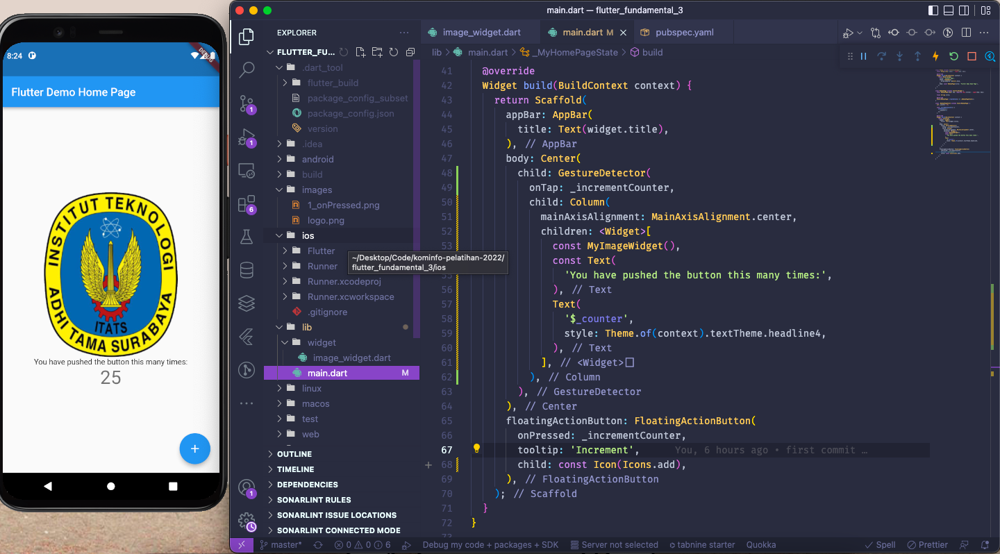
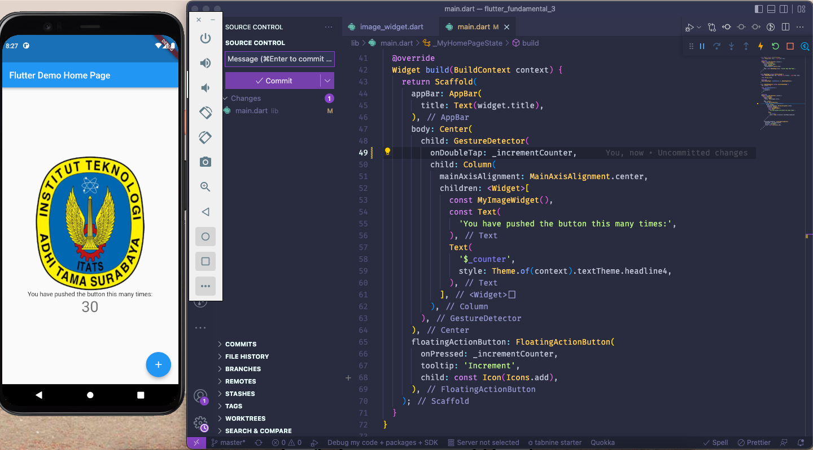
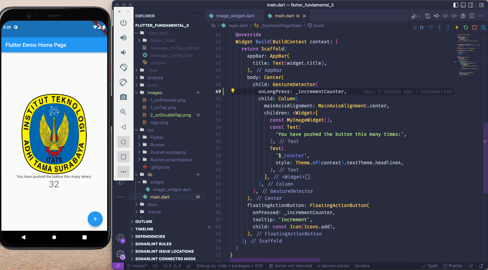
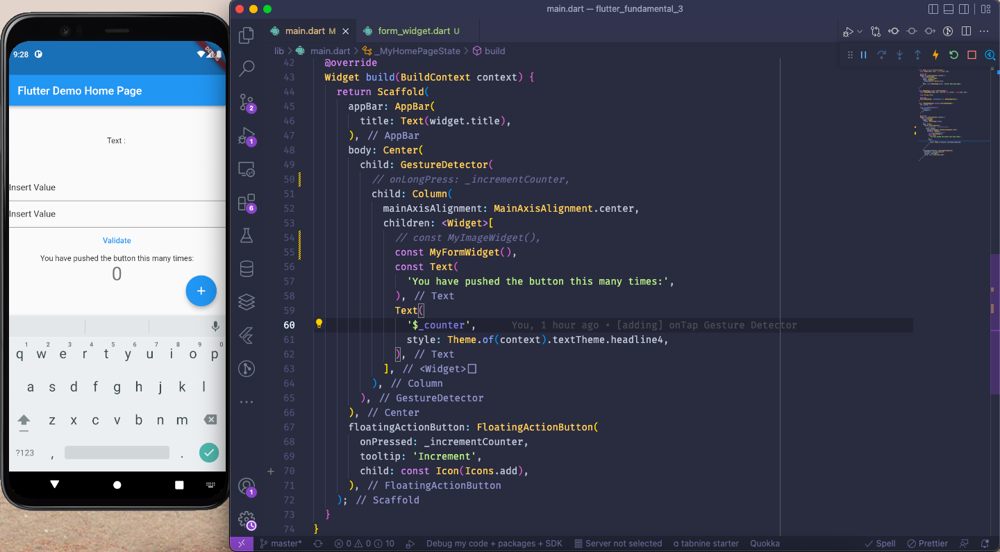
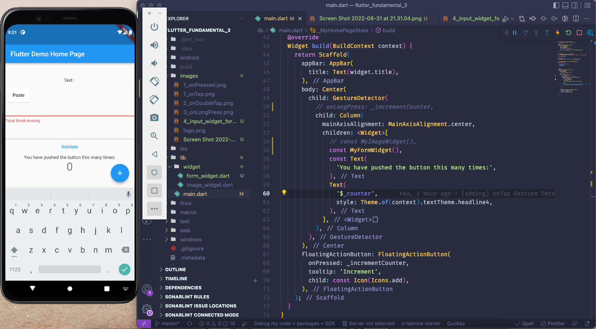
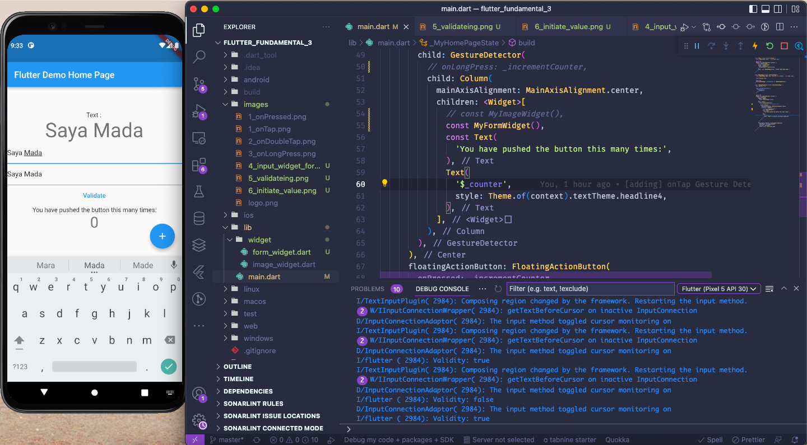
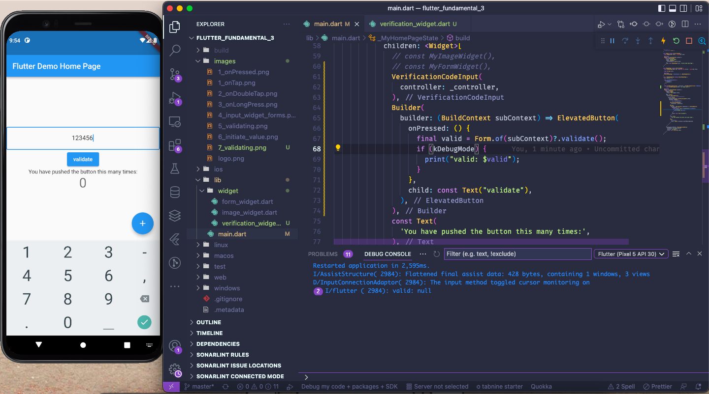
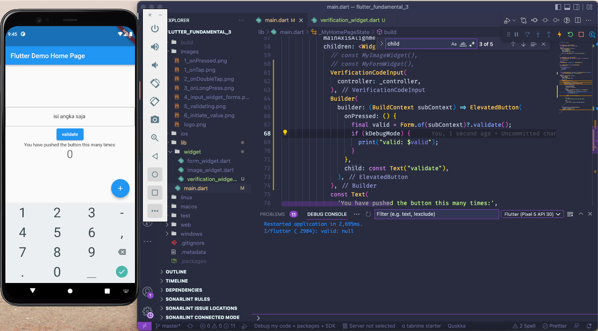

# flutter_fundamental_3

## Praktikum 1: Menerapkan Gesture Detector

### onTap: Akan menjalankan perintah jika kita melakukan tap 1 kali

### onDoubleTap: Akan menjalankan perintah jika kita melakukan tap 2 kali

### onLongPress: Akan menjalankan perintah jika kita menahan tap 

## Praktikum 2: Menerapkan Input Widget dan Forms

### Berguna untuk validasi inputan pada form

### Jika tidak sesuai maka akan memberikan pesan khusus

### Jika sesuai maka akan menampilkan validasi <code>true</code> dan akan ditampilkan pada Top Text

## Praktikum 3: Menerapkan Custom Input dan FormField Widget

### Hanya akan menerima inputan angka 1-9 saja 

### Tidak dapat berisi huruf

